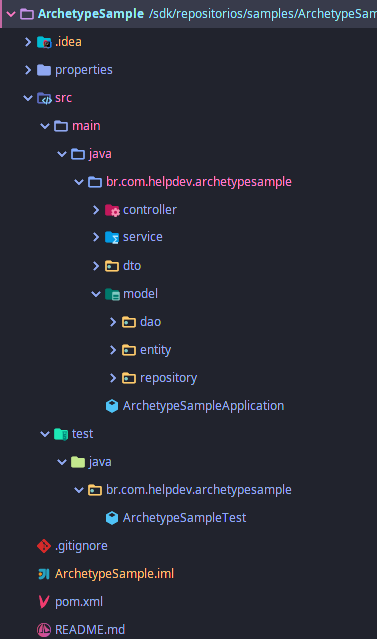
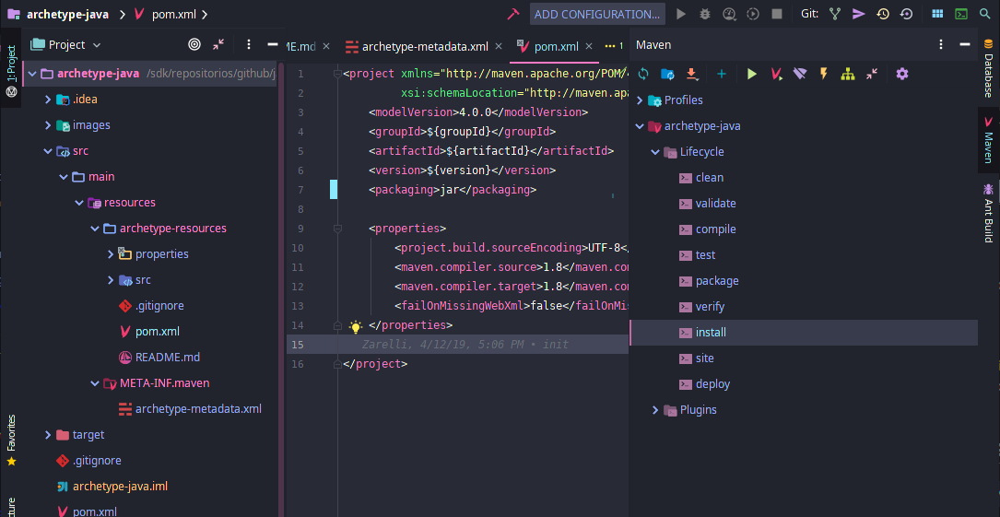
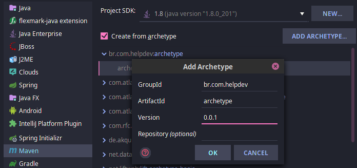
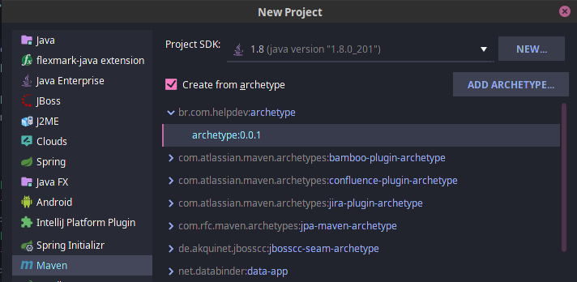

# Archetype Java

 This Archetype creates:
 
  - Folder structure
  - .gitignore and README.md
  - External properties folder
  - Classes as an sample
  
## Sample of project created with this archetype

## How to use

 In IntelliJ:
  
 - Open the archetype project and run maven install
 
 
 
 - File -> New -> Project -> Maven -> (mark) Create from archetype -> Add Archetype
 

 
 - Select the archetype and complete the creation.
 

## Based of:

 - https://www.baeldung.com/maven-archetype
 - https://github.com/eugenp/tutorials/tree/master/maven-archetype
